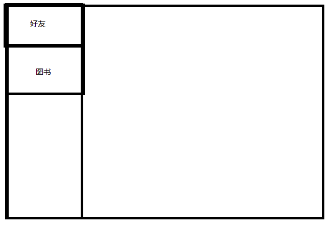
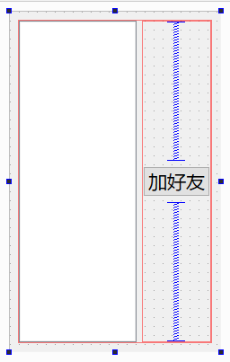
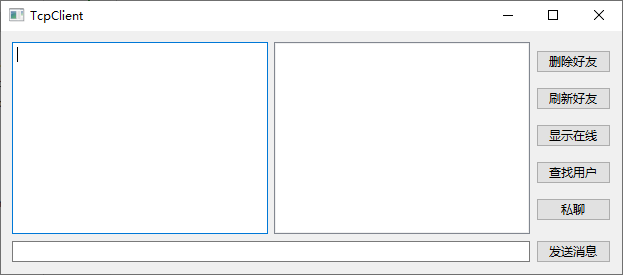
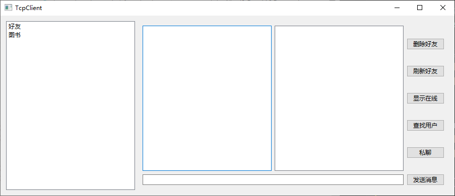

界面大概是：

在客户端新建c++class类，类名OpeWidget，基类QWidget  
opewidget.h产生左边的界面列表
```cpp
#include<QListWidget>

private:
    QListWidget *m_listWidget;
```
opewidget.cpp构造函数中new
```cpp
m_listWidget=new QListWidget(this);
m_listWidget->addItem("好友");
m_listWidget->addItem("图书");
```

新建qt设计师界面qt widget desiger from class,选widget，类名Online

添加：
按钮：加好友（addfriend_btn）
列表(list widget)：（online_lw）

点击列表添加测试
在main.cpp中,
```cpp
#include "online.h"
    // TcpClient w;
    // w.show();
    Online w;
    w.show();
```

添加好友信息，消息列表界面  
再添加c++类，类名Friend，基类QWidget
friend.h
```cpp
#include <QTextEdit>//多行文本编辑框，用于显示聊天记录
#include <QListWidget>//列表控件
#include <QLineEdit>//单行输入框，用来输入用户名、密码、聊天消息等
#include <QPushButton>//按钮控件
#include <QVBoxLayout>//垂直布局
#include <QHBoxLayout>//水平布局

private:
    QTextEdit *m_pShowMsgTE;//显示聊天记录
    QListWidget *m_pFriendListWidget;//好友列表
    QLineEdit *m_pInputMsgLE;//输入框

    QPushButton *m_pDelFriendPB;//删除好友按钮
    QPushButton *m_pFlushFriendPB;//刷新好友按钮
    QPushButton *m_pShowOnlineUsrPB;//显示在线用户按钮
    QPushButton *m_pSearchUsrPB;//搜索用户按钮

    QPushButton *m_pMsgSendPB;//发送消息按钮
    QPushButton *m_pPrivateChatPB;//私聊按钮
```
friend.cpp构造函数中new
```cpp
m_pShowMsgTE = new QTextEdit;
m_pFriendListWidget = new QListWidget;
m_pInputMsgLE = new QLineEdit;

m_pDelFriendPB = new QPushButton("删除好友");
m_pFlushFriendPB = new QPushButton("刷新好友");
m_pShowOnlineUsrPB = new QPushButton("显示在线");
m_pSearchUsrPB = new QPushButton("查找用户");

m_pMsgSendPB = new QPushButton("发送消息");
m_pPrivateChatPB = new QPushButton("私聊");
//按钮垂直布局
    QVBoxLayout *pRightPBVBL = new QVBoxLayout;
    pRightPBVBL->addWidget(m_pDelFriendPB);
    pRightPBVBL->addWidget(m_pFlushFriendPB);
    pRightPBVBL->addWidget(m_pShowOnlineUsrPB);
    pRightPBVBL->addWidget(m_pSearchUsrPB);
    pRightPBVBL->addWidget(m_pPrivateChatPB);
//聊天区 + 好友列表 + 按钮栏水平布局
    QHBoxLayout *pTopHBL = new QHBoxLayout;
    pTopHBL->addWidget(m_pShowMsgTE);
    pTopHBL->addWidget(m_pFriendListWidget);
    pTopHBL->addLayout(pRightPBVBL);
//输入框 + 发送按钮水平布局
    QHBoxLayout *pMsgHBL = new QHBoxLayout;
    pMsgHBL->addWidget(m_pInputMsgLE);
    pMsgHBL->addWidget(m_pMsgSendPB);
//主布局
    QVBoxLayout *pMain = new QVBoxLayout;
    pMain->addLayout(pTopHBL);
    pMain->addLayout(pMsgHBL);
    setLayout(pMain);
```
最终效果

friend.h加上在线用户界面
```cpp
include "online.h"
private:
    Online *m_pOnline;
```
friend.cpp构造函数中
```cpp
m_pOnline = new Online;

pMain->addWidget(m_pOnline);
    m_pOnline->hide();//开始先隐藏
```

添加信号槽显示在线用户界面
friend.h
```cpp
public slots:
    void showOnline();
```
friend.cpp槽函数
```cpp
void Friend::showOnline()
{
    if(m_pOnline->isHidden()){
        m_pOnline->show();
    }
    else{
        m_pOnline->hide();
    }
}
//构造函数中连接信号和槽
connect(m_pShowOnlineUsrPB,SIGNAL(clicked()),this,SLOT(showOnline()));
```

图书界面
添加c++类，类名Book，基类QWidget
opewidget.h
```cpp
#include "friend.h"
#include "book.h"
#include <QStackedWidget>//堆叠窗口控件，可以在同一位置显示多个子窗口，但一次只能显示一个
private:
    Friend *m_pfriend;//好友界面
    Book *m_pbook;//图书界面
    QStackedWidget *m_pSW;//后加堆叠窗口
```
opewidget.cpp构造函数中new
```cpp
m_pfriend=new Friend;//这两个界面只能显示一个，所以放在堆叠窗口中
m_pbook=new Book;

m_pSW=new QStackedWidget(this);//堆叠窗口放在opewidget中,默认显示第一个
m_pSW->addWidget(m_pfriend);
m_pSW->addWidget(m_pbook);
//水平布局
QHBoxLayout *pMain = new QHBoxLayout;
pMain->addWidget(m_listWidget);//左边的界面列表
pMain->addWidget(m_pSW);

setLayout(pMain);
```
最终效果

  

左边有好友和图书两个选项，点击不同的选项显示不同的界面
opewidget.cpp构造中添加
```cpp
connect(m_listWidget,SIGNAL(currentRowChanged(int)),m_pSW,SLOT(setCurrentIndex(int)));
//点击列表发出信号，第一个选项对应第一个界面，第二个选项对应第二个界面
```


- client在qt中多开：在首选项中，找到构建和运行，往下找到 “构建前停止应用程序” 这一项，将设置改为none
