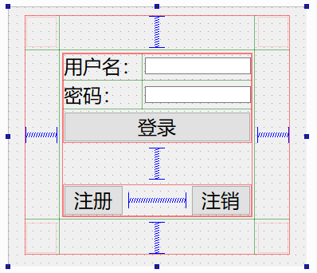

# 登录注册注销请求

## 消息类型
protocol.h服务器也要添加
```cpp
//将消息类型写成枚举类
enum ENUM_MSG_TYPE{
    ENUM_MSG_TYPE_MIN=0,
    ENUM_MSG_TYPE_REGiST_REQUEST,//注册请求
    ENUM_MSG_TYPE_REGIST_RESPOND,//回复类型
    // ENUM_MSG_TYPE_REQUEST,
    // ENUM_MSG_TYPE_RESPOND,
    // ENUM_MSG_TYPE_REQUEST,
    // ENUM_MSG_TYPE_RESPOND,
    ENUM_MSG_TYPE_MAX=0x00ffffff
};
```
## 界面设计

将各个组件设置对象名，密码输入框的echoMode设置为Password  
按钮添加点击事件，转到槽函数  
先注释掉发送数据的代码  
tcpclient.cpp
```cpp
void TcpClient::on_login_btn_clicked()
{

}

//注册按钮的槽函数
void TcpClient::on_regist_btn_clicked()
{
    QString strname=ui->name_edit->text();
    QString strpwd=ui->pwd_edit->text();
    if(!strname.isEmpty() && !strpwd.isEmpty())//都不为空
    {
        PDU*pdu=makePDU(0);
        pdu->uiMsgType=ENUM_MSG_TYPE_REGiST_REQUEST; //注册请求类型
        strncpy(pdu->caData,strname.toStdString().c_str(),32);
        strncpy(pdu->caData+32,strpwd.toStdString().c_str(),32);
        //通过socket发送
        m_tcpSocket.write((char*)pdu,pdu->uiPDULen);
        free(pdu);
        pdu=NULL;
    }else{
        QMessageBox::warning(this,"错误","注册失败:用户名或密码不能为空");
    }
}


void TcpClient::on_logout_clicked()
{

}

```
打开TcpServer  
mytcpsocket.cpp在接受信息的函数加上
```cpp
    char caName[32]={'\0'};
    char caPwd[32]={'\0'};
    strncpy(caName,pdu->caData,32);
    strncpy(caPwd,pdu->caData+32,32);
    qDebug()<<"用户名:"<<caName<<"密码:"<<caPwd;//测试是否正确接收数据
```
将注册信息写入数据库  
在opedb.h
```cpp
public:
    bool handleRegist(const char* name,const char* pwd);
```
opedb.cpp
```cpp
bool OpeDB::handleRegist(const char *name, const char *pwd)
{
    if(name==nullptr || pwd==nullptr)
    {
        return false;
    }
    //使用sql语句写入
    QString data=QString("insert into usrinfo(name,pwd) values('%1','%2')").arg(name).arg(pwd);
    QSqlQuery query;
    return query.exec(data);//判断重名是由底层数据库来判断的，如果有重名会返回false
}
```
将注册请求封装一下mytcpsocket.cpp,在receiveMsg()中添加
```cpp  
#include"opedb.h"
switch(pdu->uiMsgType){
    case ENUM_MSG_TYPE_REGiST_REQUEST:{//注册请求
        char caName[32]={'\0'};
        char caPwd[32]={'\0'};
        strncpy(caName,pdu->caData,32);
        strncpy(caPwd,pdu->caData+32,32);
        //qDebug()<<caName<<caPwd<<pdu->uiMsgType;
        bool ret=OpeDB::getInstance().handleRegist(caName,caPwd);
        PDU* respondPDU=makePDU(0);
        respondPDU->uiMsgType=ENUM_MSG_TYPE_REGIST_RESPOND;//注册回复类型
        if(ret)//在procotol.h中添加宏
        //#define REGIST_OK "regist ok"
        //#define REGIST_FAILED "regist failed"
        {
           strcpy(respondPDU->caData,REGIST_OK);
           //发送给客户端
           
        }
        else{
           strcpy(respondPDU->caData,REGIST_FAILED);
        }
        write((char*)respondPDU,respondPDU->uiPDULen);
        free(respondPDU);
        respondPDU=NULL;
        break;

    }
    default:
        break;
    }
    free(pdu);
    pdu=NULL;
```
客户端接收数据
在tcpclient.h中添加
```cpp
public slots:
    void receivemsg(); 
```
在tcpclient.cpp中构造函数关联信号槽
```cpp
connect(&m_tcpSocket,SIGNAL(readyRead()),this,SLOT(receivemsg()));

void TcpClient::receivemsg()
{
    qDebug()<<m_tcpSocket.bytesAvailable();
    uint uiPDULen=0;
    //先读出前4字节
    m_tcpSocket.read((char*)&uiPDULen,sizeof(uint));
    //实际消息长度
    uint uiMsgLen=uiPDULen-sizeof(PDU);
    PDU*pdu=makePDU(uiMsgLen);
    //读取其余数据
    m_tcpSocket.read((char*)pdu+sizeof(uint),uiPDULen-sizeof(uint));
    //qDebug()<<pdu->uiMsgType<<(char*)(pdu->caMsg);
    switch(pdu->uiMsgType){
    case ENUM_MSG_TYPE_REGIST_RESPOND:{//回复类型
        if(0==strcmp(pdu->caData,REGIST_OK)){
            QMessageBox::information(this,"注册","成功");
        }
        else if(0==strcmp(pdu->caData,REGIST_FAILED)){
            QMessageBox::warning(this,"注册","失败");

        }

        break;


    }
    default:
        break;
    }
    free(pdu);
    pdu=NULL;

}
```


## 注销，删除好友信息，删除个人信息，删除网盘文件