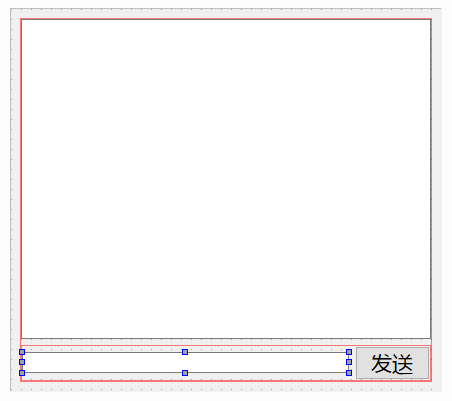

# 弹性结构体

弹性结构体是指在 C/C++ 中，结构体的最后一个成员被定义为未知大小或长度为0的数组


```c
struct Package {
    int length;       // 包裹的数据长度 (记录后面需要多大空间)
    char items[0];    // 柔性数组，相当于一个没有固定长度的口袋
};
```

# 通讯协议设计
总的消息大小    uiPDULen  
消息类型       uiMsgType
实际消息大小    uiMsgLen
实际消息       caMsg[]

## 打开Tcpclient项目
在Tcpclient新建头文件protocol.h  
protocol.h
```cpp
//将总的长度定义为无符号整型
typedef unsigned int uint;
    
struct PDU
{
    uint uiPDULen;//总的协议数据单元大小
    uint uiMsgType;//消息类型
    char caData[64];//文件名
    uint uiMsgLen;//实际消息长度
    int caMsg[];//实际消息
};

PDU* makePDU(uint uiMsgLen);
```

新建protocol.cpp文件
protocol.cpp
```cpp
#include <stdlib.h>
#include <string.h>
#include "protocol.h"
PDU *makePDU(uint uiMsgLen)
{
    //计算总长度 (固定头大小 + 实际负载大小)
    uint uiPDULen=sizeof(PDU)+uiMsgLen;
    //动态分配内存给pdu
    PDU *pdu=(PDU*)malloc(uiPDULen);
    if(pdu==NULL){
        exit(EXIT_FAILURE);
    }
    memset(pdu,0,uiPDULen);
    //初始化
    pdu->uiMsgLen = uiMsgLen;
    pdu->uiPDULen = uiPDULen; 
    return pdu;  
    
}
```
# 数据收发测试
## 打开TcpClient的ui界面
添加一个文本框，一个输入框，一个发送按钮  
改按钮的qobjectname的值为send_pb



点击按钮转到槽,发送数据的槽函数  
tcpclient.cpp
```cpp
#include "protocol.h"
void TcpClient::on_send_pb_clicked()
{
    //获取输入框的文本
    QString strMsg=ui->lineEdit->text();
    //如果输入框是空的，不发送
    if(strMsg.isEmpty()){
        QMessageBox::warning(this,"信息发送","发送的信息不能为空");
    }
    else{
        PDU*pdu=makePDU(strMsg.size());
        pdu->uiMsgType=8888;//临时数据类型
        memcpy(pdu->caMsg,strMsg.toStdString().c_str(),strMsg.size());
        //视频笔误pdu->caData
        //发送数据
        m_tcpSocket.write((char*)pdu,pdu->uiPDULen);
        free(pdu);
        pdu=NULL;
    }
}
```

## 打开TcpServer
有多个客户端，会产生多个socket对象，所以需要一个类来管理socket对象  
添加c++ Class类名MyTcpSocket，基类选择QTcpSocket

mytcpsocket.h
```cpp
#include"protocol.h"
//加上Q_OBJECT
public slots:
    //接受函数
    void receiveMsg();
```
mytcpsocket.cpp
```cpp
#include "mytcpsocket.h"
#include <QDebug>
MyTcpSocket::MyTcpSocket(QObject *parent)
    : QTcpSocket{parent}
{
    //只要有数据可读，就调用receiveMsg函数
    connect(this,SIGNAL(readyRead()),this,SLOT(receiveMsg()));
}

void MyTcpSocket::receiveMsg()
{
    qDebug()<<this->bytesAvailable();
    uint uiPDULen=0;
    //先读出前4字节
    this->read((char*)&uiPDULen,sizeof(uint));
    //实际消息长度
    uint uiMsgLen=uiPDULen-sizeof(PDU);
    PDU*pdu=makePDU(uiMsgLen);
    //读取其余数据
    this->read((char*)pdu+sizeof(uint),uiPDULen-sizeof(uint));
    qDebug()<<pdu->uiMsgType<<(char*)(pdu->caMsg);
}
```
由于服务端也要PDU结构体，所以把protocol.h和protocol.cpp文件复制到TcpServer项目中，并且在mytcpsocket.cpp中添加头文件  
mytcpserver.h
```cpp
//定义一个列表保存所有的socket对象
#include <QList>
#include "mytcpsocket.h"
private:
    QList<MyTcpSocket*> m_tcpSocketList;
```
mytcpserver.cpp补充函数
```cpp
void MyTcpServer::incomingConnection(qintptr socketDescriptor)
{
    qDebug()<<"new connected";

    MyTcpSocket*pTcpSocket=new MyTcpSocket;
    pTcpSocket->setSocketDescriptor(socketDescriptor);
    m_tcpSocketList.append(pTcpSocket);
}
```
先打开服务端，再打开客户端，输入消息点击发送，服务端就会打印出消息类型和消息内容


